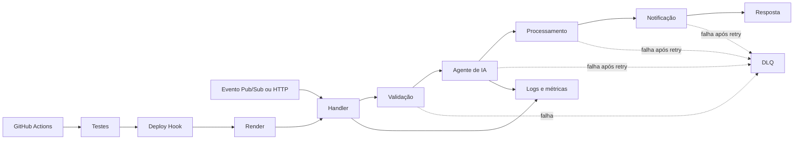

# Projeto Final - Pipeline event-driven com IA

Pipeline event-driven de pedidos com idempotência, retry, DLQ, observabilidade, integração opcional com modelo de IA e deploy automático no Render por GitHub Actions.

## Arquitetura



O evento entra pelo `src/handler.js`, é validado e segue para `src/ai.js`. O agente classifica o pedido por categoria, prioridade e recomendação. A análise é anexada ao pedido e consumida pelo processamento. Cada etapa do orquestrador possui retry; falhas definitivas podem ser enviadas à DLQ. Logs estruturados e métricas acompanham o fluxo sem registrar payloads ou credenciais.

## Provedor utilizado

* Render
* GitHub Actions
* Node.js
* Logs estruturados em JSON
* API de IA compatível com Chat Completions (opcional)

## Como rodar localmente

### Pré-requisitos

* Node.js versão 18 ou superior
* Terminal aberto na raiz do projeto

```bash
npm install
npm test
npm start
```

Para demonstrar o fluxo completo localmente, envie um evento Pub/Sub para `/pedidos`:

```bash
curl -X POST http://localhost:3000/pedidos -H "Content-Type: application/json" -d "{\"message\":{\"data\":\"eyJvcmRlcklkIjoicGVkaWRvLTEiLCJ0b3RhbCI6NzAwfQ==\",\"messageId\":\"demo-1\"}}"
```

Sem `AI_API_URL` e `AI_API_KEY`, o projeto usa um classificador local determinístico. Com as duas variáveis preenchidas, `src/ai.js` chama o endpoint configurado usando `AI_MODEL`. A chave nunca é registrada nos logs ou versionada.

Os logs locais são linhas JSON no stdout. Cada registro inclui `severity`, `message`, `timestamp` e `messageId`, sem registrar o conteúdo do pedido ou credenciais. O módulo `src/observability.js` também mantém contadores para testes e desenvolvimento local.

## Sinais instrumentados

* `mensagensRecebidas`: eventos Pub/Sub recebidos.
* `mensagensProcessadas`: eventos aceitos e processados.
* `mensagensDuplicadas`: eventos ignorados pela idempotência.
* `tentativasRetry`: novas tentativas após falha transitória.
* `falhas`: entradas inválidas ou execuções definitivas com erro.
* `duracaoTotalMs`: duração acumulada das operações instrumentadas.

O orquestrador registra `orquestracao_iniciada`, `retry_agendado`, `mensagem_duplicada`, `orquestracao_concluida` e `orquestracao_falhou`.

## Decisões arquiteturais

* **Eventos na entrada:** desacoplam a recepção do pedido do processamento e permitem reprocessamento controlado.
* **Orquestração no núcleo:** validação, IA, processamento e notificação têm ordem, retry e DLQ explícitos; isso é mais adequado que coreografia quando a consistência depende da sequência.
* **IA atrás de um adaptador:** o orquestrador não depende de um fornecedor específico; o endpoint pode ser trocado sem alterar o domínio.
* **Fallback local:** mantém testes e demonstrações reproduzíveis sem credenciais ou custo de API. Em produção, `AI_API_URL` habilita o modelo externo.
* **Idempotência por `messageId`:** evita duplicidade em redelivery. O `Map` atual é adequado à demonstração; em produção deve ser substituído por armazenamento compartilhado com TTL.
* **Render + GitHub Actions:** evita dependência de créditos GCP e mantém testes antes do deploy por Deploy Hook protegido em Secret.

## Segurança

Não versionar `.env`, chaves JSON, tokens ou URLs privadas. O arquivo `.env.example` contém somente nomes de variáveis. `RENDER_DEPLOY_HOOK` fica no environment `production` do GitHub; `AI_API_KEY` deve ser configurada somente no provedor de deploy ou em Secret Manager.

## Roteiro da apresentação

Em 2 a 5 minutos: mostre o diagrama; explique o evento como entrada; demonstre `src/ai.js` e o fallback; mostre retry, idempotência e DLQ; execute `npm test` e destaque os 9 testes; finalize com o workflow do GitHub Actions e o Deploy Hook do Render.

## Evidências

Execute `npm test` e capture o terminal com os 9 testes aprovados e as linhas JSON emitidas. No Render, confirme o serviço ativo e os logs da aplicação. Os testes automatizados em `test/handler.test.js` comprovam processamento, duplicidade, retry, IA, DLQ, logs e contadores.

Não há prints ou URLs privadas versionados neste repositório. As capturas devem ser adicionadas à entrega do Canvas, após remover dados sensíveis.

## Análise e otimizações propostas

1. **Persistir idempotência fora da memória:** trocar o `Map` local por Firestore ou Memorystore com TTL. Isso evita reprocessamento quando a função escala horizontalmente ou reinicia, aumentando a confiabilidade; o TTL limita custo e crescimento do armazenamento.
2. **Reduzir cardinalidade dos logs:** manter `messageId` para correlação, mas evitar incluir payloads e atributos de alta cardinalidade. Isso reduz volume de Logging e custo de armazenamento sem perder capacidade de diagnóstico.
3. **Separar retry de falhas permanentes:** classificar respostas HTTP 4xx como não retryáveis e reservar as três tentativas para 5xx/timeouts. Isso diminui latência e chamadas inúteis, reduzindo custo e acelerando o envio de mensagens inválidas para a DLQ.

## CI/CD e segurança

O arquivo `.github/workflows/deploy.yml` executa `npm ci` e `npm test` antes de acionar o deploy do serviço no Render. Ele é executado em alterações na branch `main` que afetem o código ou a configuração do serviço e também pode ser iniciado manualmente pela aba **Actions** do GitHub. A definição do serviço está em `render.yaml`.

### Configuração dos secrets

No repositório GitHub, crie o environment `production` e configure o seguinte **Secret**:

* `RENDER_DEPLOY_HOOK`: URL privada do Deploy Hook criado nas configurações do serviço Render.

O Deploy Hook deve ser mantido somente nos Secrets do GitHub. O pipeline não utiliza usuário, senha ou chave JSON.

### Evidência do deploy

Após a primeira execução bem-sucedida, abra **Actions > Deploy no Render**, selecione o job concluído e copie o link ou o log para a entrega no Canvas. A execução deve mostrar as etapas **Instalar dependências**, **Executar testes** e **Publicar serviço no Render** com sucesso. No painel do Render, confirme também que o deploy foi concluído. Não versionar prints com tokens, URLs privadas ou outros dados sensíveis.

O serviço Render executa a API Node definida em `src/local.js`, usando a porta fornecida pela variável `PORT`.

Nunca versione tokens, arquivos `.json`, `.env`, URLs privadas ou links de dashboards privados.
